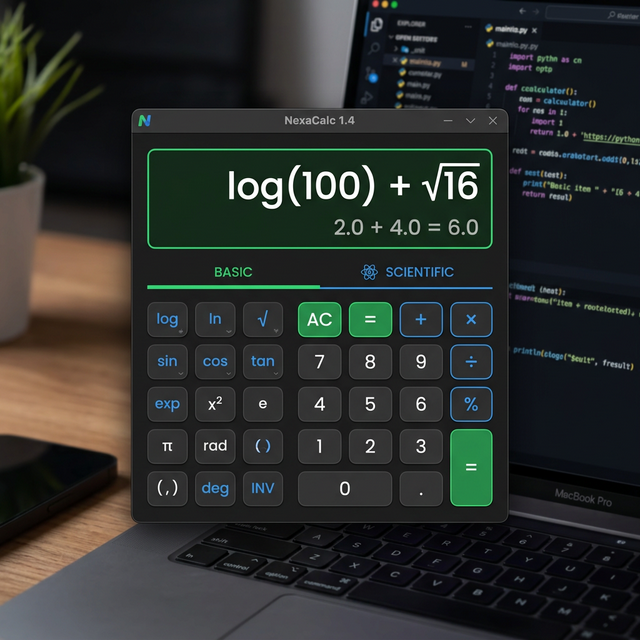

# 🧮 Calculadora Pro (Python & CustomTkinter)

Una calculadora de escritorio moderna, profesional y altamente funcional desarrollada en Python utilizando la biblioteca `customtkinter`. Esta aplicación ofrece una experiencia de usuario fluida con soporte para operaciones básicas y funciones científicas.



## 🌟 Características

- **✨ Interfaz Moderna:** Diseño limpio y elegante con un tema oscuro/claro personalizable (mediante `customtkinter`).
- **📐 Modos de Operación:**
  - **Básico:** Operaciones aritméticas elementales (+, -, *, /).
  - **Científico:** Soporte para funciones trigonométricas (sin, cos, tan, asin, etc.), logaritmos, potencias y constantes (π, e).
- **🔄 Conversión de Ángulos:** Alterna fácilmente entre Grados (DEG) y Radianes (RAD).
- **🖥️ Ventana Adaptable:** La ventana cambia dinámicamente de tamaño al activar o desactivar el modo científico.
- **🛡️ Evaluación Segura:** Las expresiones matemáticas se evalúan en un entorno seguro.

## 🚀 Requisitos e Instalación

### Requisitos Previos

- Python 3.7 o superior instalado.

### Instalación

1. **Clona el repositorio:**

    ```bash
    git clone https://github.com/tu-usuario/nombre-del-repo.git
    cd nombre-del-repo
    ```

2. **Crea y activa un entorno virtual (opcional pero recomendado):**

    ```bash
    python -m venv .venv
    # En Windows:
    .venv\Scripts\activate
    # En macOS/Linux:
    source .venv/bin/activate
    ```

3. **Instala las dependencias:**

    ```bash
    pip install -r requirements.txt
    ```

## 🛠️ Cómo Usar

Simplemente ejecuta el script principal:

```bash
python main.py
```

- **Para modo científico:** Haz clic en el botón "Modo Científico" para expandir las funciones.
- **Para borrar:** Usa el botón "C".
- **Para calcular:** Presiona "=" o presiona Enter (si se implementa en el futuro).

## 📁 Estructura del Proyecto

- `main.py`: Código fuente principal de la aplicación.
- `requirements.txt`: Lista de dependencias del proyecto.
- `.gitignore`: Configuración de archivos excluidos para Git.

---
Hecho con ❤️ en Python.
